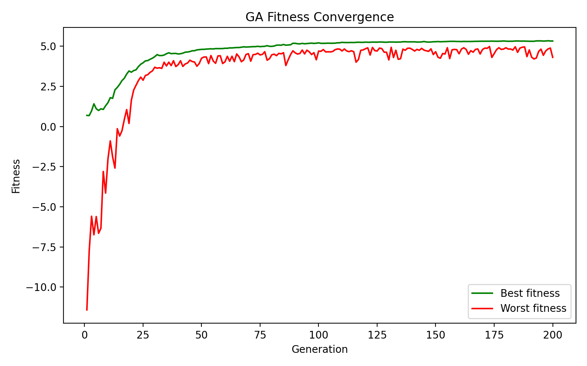
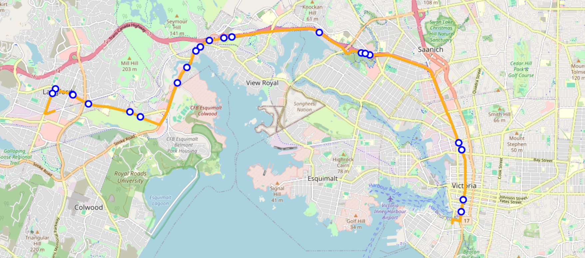
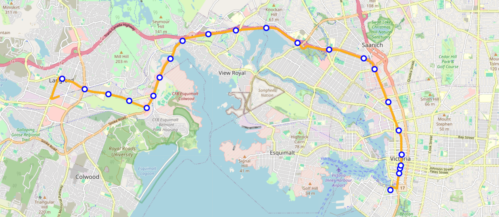
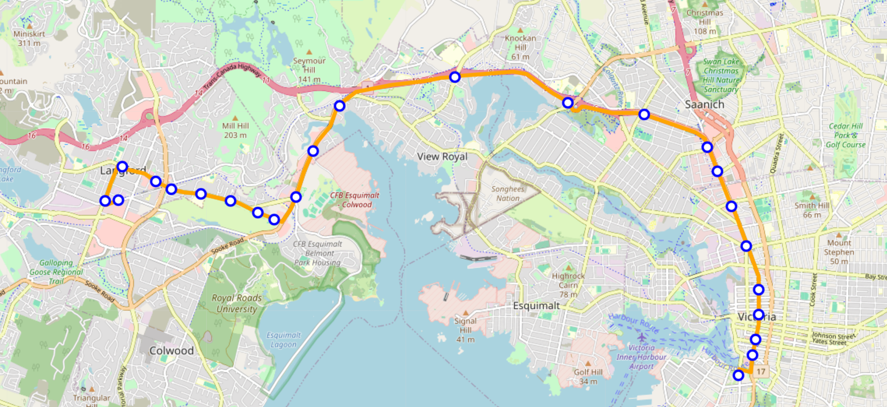
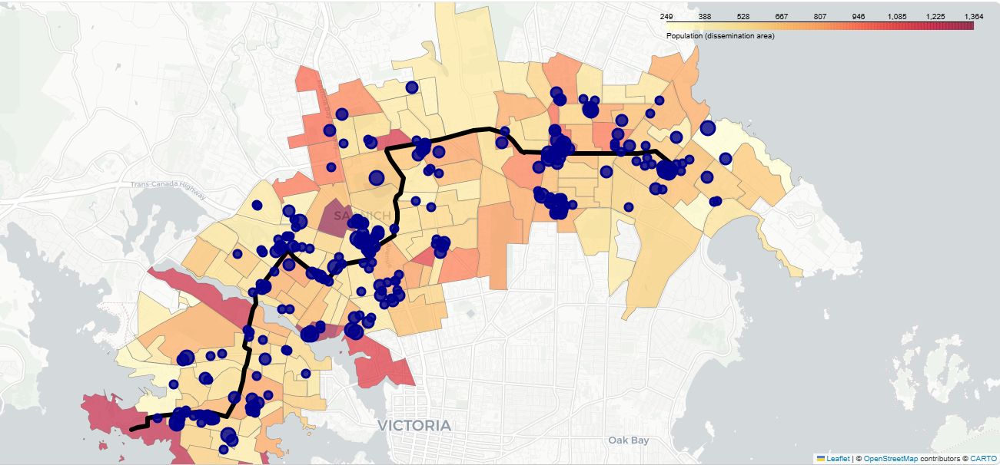
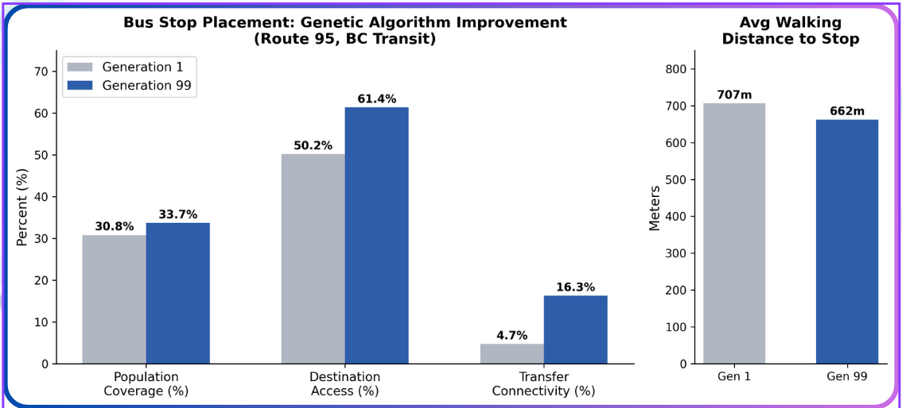

# Bus Stop Optimization
### ECE 470: Artificial Intelligence — Group 4
**July 31, 2026**

Scott Garneau (V01000495) · Joe Bresee (V01005288) · Quinn Webster (V00999291)

---

## Table of Contents
- [Abstract](#abstract)
- [Introduction](#introduction)
- [Related Work](#related-work)
- [Problem Formulation](#problem-formulation)
  - [Objective Function](#objective-function)
- [Methodology and Evaluation](#methodology-and-evaluation)
  - [Fitness Function and Weight Tuning](#fitness-function-and-weight-tuning)
- [Results and Discussions](#results-and-discussions)
- [Limitations](#limitations)
- [Future Work](#future-work)
- [Conclusion](#conclusion)
- [Appendix](#appendix)
- [Work Distribution](#work-distribution)
- [AI Tools Used](#ai-tools-used)
- [GitHub](#github)
- [References](#references)

---

## Abstract

Bus stop placement directly affects how accessible and efficient a transit system is, yet transit agencies like BC Transit currently rely on rule-based planning guidelines and manual judgment rather than formal optimization to site stops along a route. There exists a gap in the process in which a model can help, through time and effort. This project explores whether a genetic algorithm can automate that process for existing Victoria bus routes. Each candidate solution represents a variable-length set of stop locations along a route's GTFS geometry, evaluated by a fitness function combining seven weighted, normalized terms: equity-weighted population coverage, walking distance, stop spacing, proximity to points of interest, stop count, estimated travel time, and transfer connectivity to other routes. Using BC Transit's existing stop placements as an external benchmark rather than a training target, the GA's converged solutions (after 150–200 iterations) closely aligned with the existing placements. It reproduced key clustering patterns (similar to around Gordon Head on Route 26 and downtown on Route 95). The results suggest that genetic algorithms can be a low-cost tool for generating optimal candidate stop layouts on new or existing routes, and by adding fitness data dimensions like physical feasibility validation, higher-resolution ridership data, and multi-route optimization the tool could approach something capable for real-world deployment.

## Introduction

Public transit plays a very important role in a majority of people's lives, especially in a large city such as Victoria. People rely on public transit to commute to work, school, social events, and exploration; furthermore, public transport is essential to reducing carbon emissions, helps reduce individual spending, and can foster a sense of community. However, despite these many benefits, public transportation is not always easily accessible to everyone. This showcases the importance of having accessible, efficient, well laid-out public transport.

When designing bus routes, transit agencies have a lot of control over the placement of bus stops along a route. Every stop added improves the coverage of a bus route; however, it also slows the bus route down. In the project, we explore the automated placement of bus stops along pre-defined, currently used bus routes in Victoria. Victoria's transit system is managed by BC Transit; by finding better bus stop locations, we aim to improve the efficiency of Victoria's public transit system, making it faster and easier for customers to use, and more cost effective for BC Transit. This could also help reduce the environmental impact that buses have on our planet, since a well-placed stop layout will optimize bus driving efficiency.

Across the many possible combinations of bus stops and parameters along a given bus route, the number of potential candidate layouts grows exponentially, making a brute-force style algorithm infeasible. Therefore, we have implemented a genetic algorithm that returns a high quality set of bus stops for a given bus route after a large number of generations. It is important to note that our genetic algorithm optimizes purely based on its fitness function and has no direct knowledge of BC Transit's existing stop placements. We instead use BC Transit's current routes as an external benchmark; the closer our generated routes resemble real-world placements, the more confidence we have that our fitness function reflects real values of bus stop location.

## Related Work

Currently, BC Transit uses a mix of methodologies to place bus stops. There is likely an internal algorithm or library used for computing bus stops, but the currently known methods are manual decision making, sequential placing (i.e., placing a stop every 400m). Existing work on bus stop placement in Victoria, such as BC Transit's Infrastructure Design Guidelines, follows a rule-based planning process instead of a formal optimization approach. Stop placement is done in two stages: target spacing is first selected based on land-use type, ranging from roughly 200–300m in central business districts to 200–800m in rural areas, and individual stop placement is then decided relative to nearby intersections (far-side, near-side, or mid-block), weighing in factors important for riders and drivers like traffic-signal visibility, gradient, and passenger transfer convenience (BC Transit, 2010). While these guidelines do already use extensive engineering and safety practice, they do not balance competing objectives such as passenger coverage, walking distance, and operational efficiency based on publicly-available resources. These objectives are left to planner judgment on a site-by-site basis (BC Transit, 2010). Hence a gap in stop placement, where an optimization-based model would fit well.

This gap motivates our genetic algorithm, which explicitly encodes these real-world trade-offs as terms in a fitness function.

## Problem Formulation

Given a bus route represented as an ordered list $R = (p_1, p_2, \ldots, p_n)$ of GPS coordinates (derived from GTFS shape data), the task is to select a variable-length set of stop locations $S = \{s_1, \ldots, s_k\}$ with each $s_i$ constrained to lie along $R$ and $k_{min} \le k \le k_{max}$, that maximizes a weighted multi-objective fitness function. Each candidate solution (chromosome) is a list of $k$ coordinates on the route geometry, with $k$ itself free to vary across individuals, thus allowing the GA to search jointly over both the number and placement of stops rather than optimizing placement for a fixed stop count.

### Objective Function

Fitness is a weighted linear combination of seven normalized terms:

$$
\text{fitness}(x) = w_{cov} \cdot C(S) \;-\; w_{walk} \cdot W(S) \;-\; w_{sp} \cdot P(S) \;+\; w_{dest} \cdot D(S) \;-\; w_{cost} \cdot N(S) \;-\; w_{time} \cdot T(S) \;+\; w_{tr} \cdot X(S)
$$

- **Coverage $C(S)$:** Equity-weighted share of population served, summing the population of each dissemination area within a fixed radius (400 m) of at least one stop, weighted by an equity multiplier (low-income share, transit-commute mode share) and normalized against the maximum achievable coverage near the route.
- **Walking distance $W(S)$:** Population-weighted mean distance from each dissemination area's centroid to its nearest stop, normalized by the coverage radius; penalizes solutions that leave demand underserved.
- **Spacing penalty $P(S)$:** Stops are projected onto the route polyline to obtain along-route positions; the penalty is the normalized mean squared deviation of consecutive stop gaps from the ideal uniform gap (route length divided by $k-1$), discouraging clustering.
- **Destination bonus $D(S)$:** Importance-weighted count of nearby points of interest (schools, hospitals, pharmacies, grocery stores, etc.) reachable within walking distance of a stop, normalized against the maximum achievable score for the route corridor.
- **Stop count $N(S)$:** Number of stops, min-max normalized, used as a proxy for infrastructure and operating cost.
- **Travel time $T(S)$:** Estimated end-to-end route time, from total route distance at an assumed average bus speed plus a fixed per-stop dwell time.
- **Transfer bonus $X(S)$:** Fraction of stops within a transfer radius of a stop on another route, rewarding placements that preserve transfer opportunities.

Coverage, destination bonus, and transfer bonus act as rewards (added); walking distance, spacing penalty, stop count, and travel time act as costs (subtracted). The combined objective therefore favors solutions that maximize equity-weighted population and destination access with the fewest, most evenly-spaced stops and shortest travel time, while preserving inter-route connectivity.

## Methodology and Evaluation

The first step of the technical process was assembling a data pipeline. We had many individual data sources that were required to build our weight function and visualize results. This included bus route geometry, population data, and places of interest (schools, work sites, social hubs…). The actual genetic algorithm implementation is as follows:

- **Chromosome representation:**
  - Each bus route is treated as one chromosome, and a chromosome is represented as a variable-length list of coordinates along that route's polyline, where each coordinate represents a bus stop.
- **Initialization:**
  - We start the GA with 100 randomly generated chromosomes, each with a length randomly chosen within a realistic number of bus stops for the route at hand.
- **Selection:**
  - To select which chromosomes produce offspring for the next generation, we use tournament selection, where three chromosomes are randomly selected from the population, and the one with the highest fitness score is chosen as a parent.
  - This method balances random exploration with a bias toward high-fitness parents, resulting in general improvement over generations without collapsing the population to only the single best individuals each round.
- **Crossover:**
  - Each child chromosome is created by randomly taking half of the bus stops from each parent.
- **Mutation:**
  - Each stop in a child chromosome has some probability of being altered, with the size of the mutation corresponding to the newly mutated stop's distance from its original position.
- **Termination:**
  - After running multiple experiments, we found that our algorithm converges after roughly 150–200 iterations. Therefore, we added a hard stop of 200 generations as the termination condition.

### Fitness Function and Weight Tuning

Three external data sources fed the fitness function. Route geometry and stop data came from BC Transit's published GTFS feed for the Victoria Regional Transit System, providing route shapes, mappings, and existing stop locations used to generate candidate routes and as the real-world benchmark for comparison (BC Transit, 2026). The population and equity indicators — dissemination-area population counts, percentage of residents in low income, and percentage commuting by transit — were drawn from Statistics Canada's 2021 Census Profile and fitted to dissemination-area boundaries for the equity-weighted coverage variable (Statistics Canada, 2022). Points of interest were gathered from OpenStreetMap via the OSMnx library, filtered to a bounding box around Greater Victoria (OpenStreetMap contributors, 2026). Each of the seven fitness terms was normalized before weights were applied. Weights were tuned manually and iteratively: early runs showed large scale mismatches between terms. Then, weights were adjusted by observing how the GA's converged output changed relative to BC Transit's actual stop placements across multiple routes and generation counts.

The evaluation of a produced bus route depends directly on the results obtained from our fitness function. As can be seen below in Figure 1, our fitness function can be seen to steadily improve over time, resulting in a better satisfaction of our route criteria.

*Figure 1. Convergence of fitness function, used to judge success of the genetic algorithm.*

To truly satisfy our objective and create a system that could take in generic city data and construct optimized bus stop placement, we could not simply tune parameters and test one route alone. Throughout the process of tuning our parameters, we switched between various routes to ensure the parameters could produce reasonable results. This inspection was done by comparing our generated routes to BC Transit's routes, which have evolved over years of adjustment.

As confirmation of our success, we ran our genetic algorithm several times and inspected the consistency of our results, to show that our solution would naturally produce valid stop placements. For example, we saw the same clustering of stops in the Gordon Head area for the 26 line, as well as clustering in the downtown area for the 95 line.

## Results and Discussions

Because BC Transit has optimized the placement of their stops through years of iterative feedback, we had a benchmark to compare our results to after testing. Although we were not trying to replicate their stop placement, we wanted to see that our algorithm would at least produce results that felt like a valid solution. Seen below are some results.

*Figure 2. Route 95 with stops placed by genetic algorithm before weighting*

*Figure 3. Route 95 with stops placed by our genetic algorithm*

*Figure 4. Route 95 with stops placed by BC Transit*

As can be seen, the overall placement of stops aligns with overall placement of BC Transit routes, with higher density regions, key hubs, and otherwise roughly even spacing.

Key challenges throughout this project were obtaining and properly using the data as well as setting up the initial chromosome configuration and the mutation step of the genetic algorithm. The most difficult data to work with was the population dissemination data, which contained multiple data layers and required more pre-processing than other data; but ended up being a very reliable fitness indicator.

When initializing a random set of bus stops for a chromosome, the way BC Transit defines their routes made this more difficult than expected. BC Transit defines each route as a polyline made up of a series of coordinates. A long straight section of road only needs a few points (2–4) to accurately define it, while a bendy section of road needs many more points (20+) to accurately define the curve. Therefore, if we just randomly sampled bus stops from these points, it would bias generation toward curvy sections over straight ones, rather than producing a truly random distribution along the route. Our fix was to randomly sample bus stops with proportion to segment length (the distance between two consecutive points); therefore, longer segments had a greater probability of receiving a stop. This resulted in a truly random bus stop generation.

Another challenge we faced was mutation. We couldn't just simply mutate a bus stop to be a random point in the coordinate space, as this could result in the mutated bus stop no longer being on the bus route. To solve this, we pre-generated 1000 equally spaced candidate bus stops along the route at the start of the algorithm. Then, during mutation, a bus stop is replaced with one of these candidates with probability inversely proportional to how big of a resulting change it would be. This made bus stops more likely to mutate to nearby candidates, but still allowed for the occasional mutation that would result in a bus stop in a fairly different location.

## Limitations

Several practical and technical limitations currently constrain the real-world applicability of the model:

- **Physical and Infrastructure Feasibility:** Candidate bus stops generated by the model are evaluated purely on spatial and demographic metrics without checking physical validity like sidewalk availability, ADA accessibility, proximity to dangerous intersections, sightlines, or road geometry. Some suggested locations may be impractical or unsafe to construct in reality.
- **Data Scope and Granularity:** The model's optimization capabilities are constrained by our reliance on publicly available open-source datasets. Private mobility, traffic-flow, and origin-destination data — which transit agencies like BC Transit often license from third-party vendors — were inaccessible for this project. This limits the granularity of our population movement models and restricts our ability to optimize for dynamic transit patterns.
- **Computational Hardware Constraints:** The genetic algorithm was executed on personal laptops. Runs with high generation counts like 100–200 took long, and slowed down the hyper-parameter tuning phase. Expanding the model to cover larger geographic regions or simultaneously process multi-route networks would likely require better computing resources to remain usable.

## Future Work

Building upon our current implementation, several algorithmic and operational improvements would significantly enhance our genetic algorithm. A good next step is to engineer the system to include bus stop placements with multiple interconnected routes accounted for at once, rather than sequentially. Adding hard-coded end-of-line stops as strict constraints will ensure generated routes align with the obvious real-world constraint. Taking more time to optimize hyperparameters would likely yield better results and understanding of the GA.

Following a consultation with the BC Transit Manager of Enterprise Data and Analytics, several key domain-specific improvements were identified to refine our fitness function:

- **Granular Ridership Data:** Incorporating publicly available boarding counts per stop will move our model beyond general spatial coverage, providing a more accurate model for actual stop utilization.
- **Daytime Activity Dynamics:** While our current model relies on census residence data, incorporating daytime activity metrics — such as workplace density, employment hubs, and peak university transit arrival times — will better capture where riders actually travel during operational hours.
- **New Fitness Constraints:** Expanding the fitness criteria to account for economic factors (e.g., profitability and operational cost) and long-term municipal infrastructure plans will ensure broader goals are met.

## Conclusion

The bus stop placement optimizer genetic algorithm we built produced outputs similar to how actual bus stops are placed by BC Transit, which we used as a goal metric. While there are one or two definitive areas of improvement like adding an end-of-line bus stop hard constraint, or engineering a system that can generate bus stops for multiple routes at a time, our current system is effectively able to determine stop placements comparable to BC Transit. If given a new bus route to be implemented in Victoria, our genetic algorithm would be able to save manual effort and costs usually used to determine the best bus stop placements. While we did encounter limitations during our project, like hardware constraints restricting the speed and number of iterations we were able to test our genetic algorithm, we were able to generate outputs within our success threshold.

Learning about how a genetic algorithm works will allow us to approach optimization problems like this from another point of view. While LLMs receive the most attention in the world of machine learning, genetic algorithms also prove to be useful in the real world. This project provided us a unique experience to create and test our own genetic algorithm for something we think can generate real value.

Talking with the Manager of Enterprise Data and Analytics from BC Transit gave real insight into how professionals approach problems like this, and all of the different angles they have to think about. Real-world constraints like team budgets, or even lack of specialty teams, made us re-think about how algorithms are designed in the real world. We were able to also get experience with platform engineering, data engineering, and as data scientists, while working on this project.

## Appendix

*Figure 5. Population densities and places of interest*

**Figure 6. Fitness function parameters and their respective weights**

| Parameter | Weight | Percent |
|---|---|---|
| Coverage | 10 | 27.0% |
| Walking Distance | 1 | 2.7% |
| Spacing Penalty | 3 | 8.1% |
| Destination Bonus | 15 | 40.5% |
| Cost Per Stop | 2 | 5.4% |
| Travel Time | 1 | 2.7% |
| Transfer | 5 | 13.5% |
| **Total** | **37** | **100%** |

*Figure 7. Fitness function parameter improvement over 100 generations*

## Work Distribution

Work was divided equally throughout the entirety of the project. Quinn was primarily in charge of building the actual genetic algorithm and how the different components of it worked together. Joe was primarily responsible for data collection and building and analyzing the weight function used in the genetic algorithm. Scott was responsible for helping design the genetic algorithm and how collected data would be used. He also extracted population data from a map to allow extraction given any coordinates. This was done by turning the map into a bunch of vertices as division lines. All team members contributed to planning, code cleanup, and report writing.

## AI Tools Used

Claude AI was used to analyze potential projects during the exploration phase of this project as we considered multiple subjects and various approaches. Claude AI and Copilot were used to help in writing code and fixing bugs.

## GitHub

[Joe-Bresee/ECE470-Genetic-Algorithm-Project](https://github.com/Joe-Bresee/ECE470-Genetic-Algorithm-Project)

## References

[1] BC Transit. (2010). *Infrastructure Design Guidelines*. https://www.bctransit.com/wp-content/uploads/2024/07/Transit-Future-Planning-Standards-and-Guidelines-Infrastructure-Design-Guidelines.pdf

[2] Statistics Canada, "Census Profile, 2021 Census of Population," Statistics Canada Catalogue no. 98-401-X2021006, Ottawa, ON, Canada, 2022. [Online]. Available: https://www150.statcan.gc.ca/n1/en/catalogue/98-401-X2021006. [Accessed: Jul. 24, 2026].

[3] BC Transit, "GTFS Data – Victoria Regional Transit System," Open Data, 2026. [Online]. Available: https://www.bctransit.com/open-data/. [Accessed: Jul. 24, 2026].

[4] OpenStreetMap contributors, "OpenStreetMap," 2026. [Online]. Available: https://www.openstreetmap.org. [Accessed: Jul. 24, 2026].